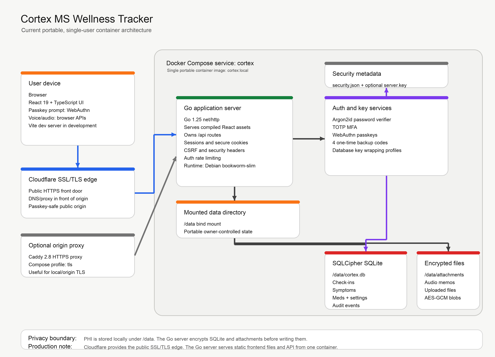

# Cortex Architecture

Cortex is a private, single-user wellness tracker for people with Multiple Sclerosis. The first draft is intentionally small: one Dockerized Go application serves the React interface, owns the security/session boundary, and stores encrypted health data in a mounted local data directory.

The main design goal is portability with strong local control. The application can run on a laptop, a small VM, or a thumb drive-backed directory, as long as Docker can mount the `data/` folder.

## Flow Diagram

## Technology Versions

The diagram above reflects the current implementation in this repository.

| Layer | Technology |
| --- | --- |
| Container runtime | Docker Compose service `cortex`, image `cortex:local` |
| SSL/TLS edge | Cloudflare in front of the deployment |
| Optional origin/local HTTPS proxy | Caddy `2.8-alpine` Compose profile `tls` |
| Runtime base image | `debian:bookworm-slim` |
| Backend language | Go `1.25.0` |
| Backend HTTP server | Go standard library `net/http` |
| Frontend app | React `19.1.0` with TypeScript `5.8.3` |
| Frontend build/dev server | Vite `6.3.5`; production assets are served by the Go server |
| SQLite encryption | SQLCipher through `github.com/mutecomm/go-sqlcipher/v4` `4.4.2` |
| Local database | SQLCipher-encrypted SQLite file at `data/cortex.db` |
| Passkeys | `github.com/go-webauthn/webauthn` `0.17.4` |
| TOTP MFA | `github.com/pquerna/otp` `1.5.0` |
| Password hashing | Argon2id through `golang.org/x/crypto` `0.52.0` |

## Request Flow

1. The user opens Cortex in a browser.
2. In a local deployment, the browser talks directly to the Go server on `http://localhost:8080`.
3. In a VM/server deployment, Cloudflare provides the public SSL/TLS edge in front of the origin.
4. Caddy remains available as an optional origin/local HTTPS proxy profile.
5. The Go server serves the compiled React app from embedded static files.
6. Browser API calls go back to the same Go server under `/api/...`.
7. The Go server enforces authentication, MFA/passkey flows, sessions, CSRF checks, HTTPS rules, rate limiting, and security headers.
8. The Go server reads and writes health records through SQLCipher-encrypted SQLite.
9. Uploaded attachments and audio memos are encrypted by the Go server and written to `data/attachments`.

## Data Boundary

The `data/` directory is the portable state boundary. If a user wants to move Cortex, this is the directory that matters.

Current contents:

- `cortex.db`: SQLCipher-encrypted SQLite database.
- `security.json`: key-wrapping metadata, password verifier metadata, recovery-code wrappers, and profile state.
- `server.key`: present only in convenience passkey mode.
- `attachments/`: encrypted attachment and audio memo blobs.

The database and attachments are not meant to be useful by themselves without the required key material. In maximum privacy mode, the password is required after restart to unwrap the database key. In convenience passkey mode, the local `server.key` can unwrap it after restart, trading restart convenience for weaker protection if the entire `data/` directory is stolen.

## Backend Responsibilities

The Go backend is the trust boundary. It is responsible for:

- Initial setup and encryption profile selection.
- Password verification and Argon2id key wrapping.
- TOTP enrollment and verification.
- Exactly four one-time backup codes.
- Passkey enrollment and login.
- Server-side sessions and CSRF tokens.
- SQLCipher database opening and migrations.
- Daily check-in, symptom, medication, attachment, settings, and clinician-summary APIs.
- PHI-safe audit events that avoid storing symptom text in audit metadata.
- Security headers, localhost-aware HTTPS enforcement, and auth rate limiting.

## Frontend Responsibilities

The React frontend is optimized for low-friction logging:

- Large home actions for `Log now`, `Daily check-in`, `Voice note`, and `Visit summary`.
- Range controls for daily symptom burden, fatigue, pain, mood, anxiety, brain fog, sleep, heat sensitivity, mobility, and bladder/bowel.
- Dictation hooks where the browser supports speech recognition.
- Local audio memo capture through the browser MediaRecorder API.
- Theme, accent color, text size, high-contrast, and reduced-motion settings.
- Passkey enrollment and login through WebAuthn browser APIs.

## Deployment Shape

The default Compose service runs only the `cortex` container:

- Non-root user `10001`.
- Read-only root filesystem.
- `/tmp` tmpfs.
- All Linux capabilities dropped.
- `no-new-privileges`.
- Explicit bind mount from `./data` to `/data`.

For server deployments, Cloudflare is the planned SSL/TLS front door. The optional `tls` Compose profile still adds Caddy when an origin/local HTTPS proxy is useful.

## Current Limits

This is a first working draft, not a finished medical product.

- Single user only.
- No backup workflow yet.
- No clinician/caregiver accounts.
- No hosted/SaaS compliance model.
- Audio is stored locally, but transcription is limited to browser/OS dictation support.
- Export is currently a JSON clinician-summary API and a simple UI view, not a polished PDF or clinical packet.
